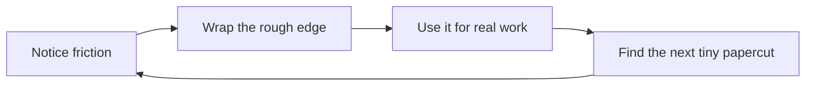

Then I looked back at AI and thought…

# Wait. This is the same problem.

  

    
🧱

    
Jira friction

    
The work was trapped behind a UI that didn’t match my loop.

  

  

    
🤖

    
AI friction

    
The model was trapped behind a chat surface that didn’t match my loop.

  

So the wrapper idea became an agent IDE.

<!--
This is the bridge into the AI IDE portion. Make it feel inevitable rather than random: the same design principle applied twice.
-->

---
layout: center
class: text-center
---

<!--
This is the strongest analogy in the talk. AI should feel native to the work.
Not like a chatbot pasted beside the work.
-->

---
layout: default
---

# Building the agent IDE meant designing for feedback loops

  

    
📚

    
Context

    
Repo, tasks, commands, history

  

  

    
👀

    
Visibility

    
What changed? Why?

  

  

    
🧯

    
Control

    
Approve, interrupt, redirect

  

  

    
🔁

    
Iteration

    
Fast loops beat perfect prompts

  

It took weeks of tuning because flow is felt in milliseconds.

<!--
Emphasize iteration. The first wrapper was not perfect. The IDE emerged from repeated friction removal.
-->

---
layout: two-cols-header
layoutClass: gap-8
---

# The old loop vs. the flow loop

::left::

Old loop: tab cardio

  
Editor

  
Browser

  
Terminal

  
Jira

  
Chatbot

  
“Where was I?”

::right::

Flow loop: close to the work

  
🧠 Intent

  
📚 Context already attached

  
🤖 Agent does bounded work

  
👀 Human reviews diff

  
✅ Momentum survives

<!--
“Tab cardio” should get a laugh. This slide summarizes why interface consolidation mattered.
-->

---
layout: center
class: text-center
---

# What changed?

  

    
⏱️

    
Latency dropped

    
Not just network latency. Human decision latency.

  

  

    
🧠

    
Context stayed warm

    
Working memory stopped falling out of my pockets.

  

  

    
🌊

    
The system disappeared

    
Which is the nicest compliment an interface can receive.

  

I got back to that vim feeling: intent turning into action almost instantly.

<!--
This is the payoff. Bring it back to the beginning: vim wasn’t the destination, it was the reference feeling.
-->
