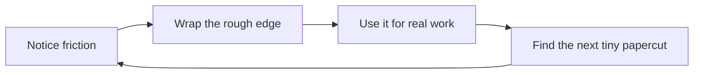

<div class="confetti"><span></span><span></span><span></span><span></span><span></span><span></span><span></span></div>

<div class="kicker mx-auto mb-7">🏙️ Tech town hall · 20 minutes · surprisingly few Jira screenshots</div>

# <span class="title-gradient">The Interface<br/>Is the Bottleneck</span>

<div class="mt-7 text-2xl muted">Chasing flow in the age of AI agents</div>

<div class="mt-12 flex justify-center gap-7">
  <div v-motion :initial="{ y: 30, opacity: 0 }" :enter="{ y: 0, opacity: 1, transition: { delay: 250 } }" class="orb floaty">⌨️</div>
  <div v-motion :initial="{ y: 30, opacity: 0 }" :enter="{ y: 0, opacity: 1, transition: { delay: 450 } }" class="orb floaty-2">🤖</div>
  <div v-motion :initial="{ y: 30, opacity: 0 }" :enter="{ y: 0, opacity: 1, transition: { delay: 650 } }" class="orb floaty">🧱</div>
</div>

<!--
Open light and personal. This is not a vendor comparison and not “AI tools are cool.”
It is a story about flow: I had it, I lost it, and I rebuilt my environment until I could get it back.
-->

---
layout: center
class: text-center
transition: fade-out
---

<div class="kicker mx-auto mb-8">The whole talk in one emotionally suspicious timeline</div>

<div class="grid grid-cols-4 gap-5 text-left">
  <div v-click class="card">
    <div class="text-5xl mb-3">🌊</div>
    <div class="text-2xl font-bold">I had flow</div>
    <div class="muted mt-2">Vim made thought → action feel tiny.</div>
  </div>
  <div v-click class="card">
    <div class="text-5xl mb-3">🤖</div>
    <div class="text-2xl font-bold">AI arrived</div>
    <div class="muted mt-2">Powerful model. Weirdly clunky ritual.</div>
  </div>
  <div v-click class="card">
    <div class="text-5xl mb-3">🧱</div>
    <div class="text-2xl font-bold">Jira got louder</div>
    <div class="muted mt-2">Not evil. Just very... clickable.</div>
  </div>
  <div v-click class="card pulse-soft">
    <div class="text-5xl mb-3">🛠️</div>
    <div class="text-2xl font-bold">I wrapped it</div>
    <div class="muted mt-2">Until the work felt close again.</div>
  </div>
</div>

<div v-click class="mt-10 text-3xl font-bold">
  I wasn’t chasing tools. I was chasing <span class="accent">flow</span>.
</div>

<!--
Set the emotional arc. The audience should know where we’re going immediately.
The joke is that “clickable” is both a product virtue and a developer tax.
-->

---
layout: statement
class: text-center
---

<div class="text-2xl muted mb-5">Core thesis</div>

# <span class="title-gradient">Productivity is often limited by the distance between intent and execution.</span>

<div v-click class="mt-12 intent-path text-left">
  <div class="card text-center">
    <div class="text-5xl">🧠</div>
    <div class="text-xl font-bold mt-2">Intent</div>
  </div>
  <div class="arrow-line"></div>
  <div class="card text-center">
    <div class="text-5xl">🧰</div>
    <div class="text-xl font-bold mt-2">Interface</div>
  </div>
  <div class="arrow-line"></div>
  <div class="card text-center">
    <div class="text-5xl">✅</div>
    <div class="text-xl font-bold mt-2">Outcome</div>
  </div>
</div>

<div v-click class="mt-8 text-xl muted">The interface is where momentum either survives… or goes to open seventeen tabs.</div>

<!--
This is the lens for the rest of the talk. We usually talk about compute, model quality, process, or features.
But the day-to-day bottleneck is often the interface between what I mean and what the system does.
-->

---
layout: two-cols
layoutClass: gap-12
transition: slide-up
---

# Act I: Vim taught me what speed actually is

<div class="text-xl muted mt-4">I used to think speed meant typing faster.</div>

<div v-click class="mt-8 card">
  <div class="text-4xl mb-2">⌨️💨</div>
  <div class="text-2xl font-bold">Then vim motions happened.</div>
  <div class="muted mt-2">And my mouse started updating its LinkedIn.</div>
</div>

::right::

<div class="grid gap-4 mt-7">
  <div v-click class="mini-card"><span class="accent">Less mouse</span> → fewer physical interruptions</div>
  <div v-click class="mini-card"><span class="accent-cyan">Composable commands</span> → tiny language for intent</div>
  <div v-click class="mini-card"><span class="accent-green">Muscle memory</span> → no negotiation with the UI</div>
  <div v-click class="mini-card"><span class="accent-pink">Flow</span> → stay on the problem</div>
</div>

<div v-click class="mt-7 text-2xl font-bold">Once the interface got out of the way, my brain stayed on the problem.</div>

<!--
Do not make this a vim superiority slide. Make it relatable: every person has had a tool become transparent.
Vim is just my example of a low-friction interface.
-->

---
layout: center
class: text-center
---

<div class="kicker mx-auto mb-8">The tiny miracle</div>

<div class="grid grid-cols-3 gap-8 items-center">
  <div v-click class="card">
    <div class="text-6xl mb-3">🧠</div>
    <div class="text-3xl font-bold">Think</div>
    <div class="muted mt-2">“change inside quotes”</div>
  </div>
  <div v-click class="card">
    <div class="text-6xl mb-3">⌨️</div>
    <div class="text-3xl font-bold">Express</div>
    <code class="text-xl">ci&quot;</code>
  </div>
  <div v-click class="card">
    <div class="text-6xl mb-3">✨</div>
    <div class="text-3xl font-bold">Done</div>
    <div class="muted mt-2">No modal scavenger hunt.</div>
  </div>
</div>

<div v-click class="mt-12 big-word title-gradient">tiny gap, big joy</div>

<!--
This is the first big emotional point: the joy is not “keyboard wizardry.”
The joy is that the system feels like it understands the shape of your intent.
-->

---
layout: two-cols-header
layoutClass: gap-10
---

# Act II: AI gave me leverage… and a new toll booth

::left::

<div class="card mt-5">
  <div class="text-5xl mb-3 wiggle">🤖</div>
  <div class="text-2xl font-bold">The model was fast.</div>
  <div class="muted mt-2">It could generate, explain, refactor, summarize.</div>
</div>

<div v-click class="mt-5 text-2xl font-bold accent">Great! Surely we are done.</div>
<div v-click class="mt-3 stamp">narrator: no</div>

::right::

<div class="grid gap-3 mt-5">
  <div v-click class="mini-card"><span class="click-tax">1</span> Gather context</div>
  <div v-click class="mini-card"><span class="click-tax">2</span> Switch editor → browser → terminal</div>
  <div v-click class="mini-card"><span class="click-tax">3</span> Re-explain the repo like it has amnesia</div>
  <div v-click class="mini-card"><span class="click-tax">4</span> Babysit the output</div>
  <div v-click class="mini-card"><span class="click-tax">5</span> Copy/paste until your soul compiles</div>
</div>

<!--
The twist: AI improved capability but added interface rituals.
Say: “The model was fast, but my workflow around the model was slow.”
-->

---
layout: statement
class: text-center
transition: fade
---

<div class="text-3xl muted mb-8">The uncomfortable sentence</div>

# The model was fast, but my <span class="accent-pink">workflow around the model</span> was slow.

<div v-click class="mt-12 grid grid-cols-3 gap-6">
  <div class="card">
    <div class="text-5xl">🏎️</div>
    <div class="text-xl font-bold mt-2">Racecar engine</div>
  </div>
  <div class="card">
    <div class="text-5xl">🍟</div>
    <div class="text-xl font-bold mt-2">Drive-thru interface</div>
  </div>
  <div class="card">
    <div class="text-5xl">🐢</div>
    <div class="text-xl font-bold mt-2">Developer velocity</div>
  </div>
</div>

<div v-click class="mt-9 text-xl muted">AI gave me leverage, but the interface taxed every interaction.</div>

<!--
This is a memorable line. Pause after “workflow around the model was slow.”
The racecar/drive-thru/turtle metaphor is intentionally silly; let the slide do the joke.
-->

---
layout: two-cols
layoutClass: gap-12
---

# Jira made the friction impossible to ignore

<div class="text-xl muted mt-4">Important disclaimer:</div>

<div v-click class="card mt-5">
  <div class="text-3xl font-bold">Jira is powerful.</div>
  <div class="muted mt-2">Powerful like a spaceship cockpit is powerful.</div>
</div>

<div v-click class="card mt-5">
  <div class="text-3xl font-bold">But power ≠ flow.</div>
  <div class="muted mt-2">Sometimes power means 11 dropdowns and a tiny loading spinner contemplating its life choices.</div>
</div>

::right::

<div class="mt-10 flex justify-center">
  <div>
    <div class="battery"><div class="battery-fill"></div></div>
    <div class="text-center mt-4 text-xl font-bold accent-pink">Working memory</div>
  </div>
</div>

<div v-click class="mt-10 text-3xl font-bold text-center">Every time I opened Jira, I felt my working memory drain.</div>

<!--
Keep this kind. The point is not “Jira bad.” The point is that a powerful general-purpose UI can be a poor fit for a keyboard-first coding loop.
-->

---
layout: center
class: text-center
---

# So I built a wrapper

<div class="text-2xl muted mt-4">Not to replace the system. To put a better interface in front of it.</div>

<div class="grid grid-cols-2 gap-8 mt-10 text-left">
  <div v-click class="card">
    <div class="text-5xl mb-3">🧱</div>
    <div class="text-2xl font-bold">Jira remained the source of truth</div>
    <div class="muted mt-2">Same data. Same workflow requirements. Fewer browser side quests.</div>
  </div>
  <div v-click class="card pulse-soft">
    <div class="text-5xl mb-3">⌨️</div>
    <div class="text-2xl font-bold">My wrapper matched how I think</div>
    <div class="muted mt-2">Keyboard-first, low latency, close to code.</div>
  </div>
</div>

<div v-click class="mt-10 text-3xl font-bold">The breakthrough was not a new backend. It was a <span class="accent">shorter path</span>.</div>

<!--
This echoes migration empathy: I did not throw out the system. I built a bridge between the system and the way I work.
-->

---
layout: two-cols-header
layoutClass: gap-10
---

# Same Jira, different surface area

::left::

<div class="text-xl font-bold mb-4">Before</div>

<div v-clicks class="grid gap-3">
  <div class="mini-card">Open browser</div>
  <div class="mini-card">Find board</div>
  <div class="mini-card">Find issue</div>
  <div class="mini-card">Wait for panel</div>
  <div class="mini-card">Click tiny thing</div>
  <div class="mini-card">Forget what I was coding</div>
</div>

::right::

<div class="text-xl font-bold mb-4">After</div>

````md magic-move {lines: true}
```bash
# thought: what am I working on?
```
```bash
$ issues mine
```
```bash
$ issues mine --status "In Progress"
```
```bash
$ issue open PAY-123
```
```bash
$ issue note PAY-123 "Found the flaky edge case"
```
````

<div v-click class="mt-5 card">
  <span class="accent-green font-bold">Flow restored:</span> issue context stayed near code context.
</div>

<!--
Use this as an illustrative sketch, not necessarily exact commands.
The important contrast is UI tourism versus direct expression of intent.
-->

---
layout: center
class: text-center
---

<div class="kicker mx-auto mb-8">Then I looked back at AI and thought…</div>

# Wait. This is the <span class="accent-pink">same problem</span>.

<div class="grid grid-cols-2 gap-8 mt-10 text-left">
  <div v-click class="card">
    <div class="text-5xl mb-3">🧱</div>
    <div class="text-2xl font-bold">Jira friction</div>
    <div class="muted mt-2">The work was trapped behind a UI that didn’t match my loop.</div>
  </div>
  <div v-click class="card">
    <div class="text-5xl mb-3">🤖</div>
    <div class="text-2xl font-bold">AI friction</div>
    <div class="muted mt-2">The model was trapped behind a chat surface that didn’t match my loop.</div>
  </div>
</div>

<div v-click class="mt-10 text-3xl font-bold">So the wrapper idea became an agent IDE.</div>

<!--
This is the bridge into the AI IDE portion. Make it feel inevitable rather than random: the same design principle applied twice.
-->

---
layout: two-cols
layoutClass: gap-12
---

# What I wanted AI to feel like

<div class="text-2xl muted mt-4">Less chatbot. More vim motions.</div>

<div v-click class="card mt-8">
  <div class="text-4xl mb-3">🧩</div>
  <div class="text-2xl font-bold">Composable</div>
  <div class="muted mt-2">Small actions that combine into real work.</div>
</div>

<div v-click class="card mt-5">
  <div class="text-4xl mb-3">🎛️</div>
  <div class="text-2xl font-bold">Controlled</div>
  <div class="muted mt-2">Humans steer. Agents execute. Nobody free-solos production.</div>
</div>

::right::

<div class="mt-6 grid gap-5">
  <div v-click class="mini-card">
    <div class="text-sm muted mb-1">Vim-ish</div>
    <div class="text-2xl"><code>operator</code> + <code>motion</code> + <code>object</code></div>
  </div>
  <div v-click class="mini-card">
    <div class="text-sm muted mb-1">Agent-ish</div>
    <div class="text-2xl"><code>intent</code> + <code>context</code> + <code>guardrails</code></div>
  </div>
  <div v-click class="card pulse-soft">
    <div class="text-2xl font-bold accent">Think → express → review → ship</div>
    <div class="muted mt-2">A tight feedback loop, not a séance with autocomplete.</div>
  </div>
</div>

<!--
This is the strongest analogy in the talk. AI should feel native to the work.
Not like a chatbot pasted beside the work.
-->

---
layout: default
---

# Building the agent IDE meant designing for feedback loops

<div class="grid grid-cols-4 gap-4 mt-8">
  <div v-click class="card">
    <div class="text-4xl mb-2">📚</div>
    <div class="text-xl font-bold">Context</div>
    <div class="muted text-sm mt-1">Repo, tasks, commands, history</div>
  </div>
  <div v-click class="card">
    <div class="text-4xl mb-2">👀</div>
    <div class="text-xl font-bold">Visibility</div>
    <div class="muted text-sm mt-1">What changed? Why?</div>
  </div>
  <div v-click class="card">
    <div class="text-4xl mb-2">🧯</div>
    <div class="text-xl font-bold">Control</div>
    <div class="muted text-sm mt-1">Approve, interrupt, redirect</div>
  </div>
  <div v-click class="card">
    <div class="text-4xl mb-2">🔁</div>
    <div class="text-xl font-bold">Iteration</div>
    <div class="muted text-sm mt-1">Fast loops beat perfect prompts</div>
  </div>
</div>



<div v-click class="mt-3 text-2xl font-bold text-center">It took weeks of tuning because flow is felt in milliseconds.</div>

<!--
Emphasize iteration. The first wrapper was not perfect. The IDE emerged from repeated friction removal.
-->

---
layout: two-cols-header
layoutClass: gap-8
---

# The old loop vs. the flow loop

::left::

<div class="text-xl font-bold mb-4">Old loop: tab cardio</div>
<div class="grid gap-3">
  <div v-click class="mini-card">Editor</div>
  <div v-click class="mini-card">Browser</div>
  <div v-click class="mini-card">Terminal</div>
  <div v-click class="mini-card">Jira</div>
  <div v-click class="mini-card">Chatbot</div>
  <div v-click class="mini-card">“Where was I?”</div>
</div>

::right::

<div class="text-xl font-bold mb-4">Flow loop: close to the work</div>
<div class="grid gap-3">
  <div v-click class="card">🧠 Intent</div>
  <div v-click class="card">📚 Context already attached</div>
  <div v-click class="card">🤖 Agent does bounded work</div>
  <div v-click class="card">👀 Human reviews diff</div>
  <div v-click class="card pulse-soft">✅ Momentum survives</div>
</div>

<!--
“Tab cardio” should get a laugh. This slide summarizes why interface consolidation mattered.
-->

---
layout: center
class: text-center
---

# What changed?

<div class="grid grid-cols-3 gap-6 mt-10 text-left">
  <div v-click class="card">
    <div class="text-5xl mb-3">⏱️</div>
    <div class="text-2xl font-bold">Latency dropped</div>
    <div class="muted mt-2">Not just network latency. Human decision latency.</div>
  </div>
  <div v-click class="card">
    <div class="text-5xl mb-3">🧠</div>
    <div class="text-2xl font-bold">Context stayed warm</div>
    <div class="muted mt-2">Working memory stopped falling out of my pockets.</div>
  </div>
  <div v-click class="card">
    <div class="text-5xl mb-3">🌊</div>
    <div class="text-2xl font-bold">The system disappeared</div>
    <div class="muted mt-2">Which is the nicest compliment an interface can receive.</div>
  </div>
</div>

<div v-click class="mt-12 text-3xl font-bold">I got back to that vim feeling: intent turning into action almost instantly.</div>

<!--
This is the payoff. Bring it back to the beginning: vim wasn’t the destination, it was the reference feeling.
-->

---
layout: default
---

# Lessons I’d steal from this

<div class="grid grid-cols-2 gap-6 mt-8">
  <div v-click class="card">
    <div class="text-4xl mb-3">🌊</div>
    <div class="text-2xl font-bold">Flow is a product requirement</div>
    <div class="muted mt-2">Not a luxury for people with mechanical keyboards.</div>
  </div>
  <div v-click class="card">
    <div class="text-4xl mb-3">📏</div>
    <div class="text-2xl font-bold">Optimize distance, not just features</div>
    <div class="muted mt-2">The best feature may be one fewer step.</div>
  </div>
  <div v-click class="card">
    <div class="text-4xl mb-3">🤖</div>
    <div class="text-2xl font-bold">AI needs workflow design</div>
    <div class="muted mt-2">A powerful model in a bad loop still feels slow.</div>
  </div>
  <div v-click class="card">
    <div class="text-4xl mb-3">🛠️</div>
    <div class="text-2xl font-bold">Wrap friction before replacing systems</div>
    <div class="muted mt-2">Bridges are underrated. Also cheaper than organizational knife fights.</div>
  </div>
</div>

<!--
These are the general-purpose takeaways for a town hall. They apply beyond my tools.
-->

---
layout: statement
class: text-center
transition: fade-out
---

<div class="confetti"><span></span><span></span><span></span><span></span><span></span><span></span><span></span></div>

<div class="text-2xl muted mb-6">Final thought</div>

# The goal wasn’t to build another tool.

<h1 v-click class="mt-8"><span class="title-gradient">The goal was to make the tool disappear.</span></h1>

<div v-click class="mt-12 text-3xl">Thank you 💛</div>
<div v-click class="mt-3 muted">Questions, comments, or strongly held opinions about vim are welcome.</div>

<!--
Close exactly here if time is tight.
Optional final callback: “If your workflow feels slow, the bottleneck may not be you — it may be the interface.”
-->
